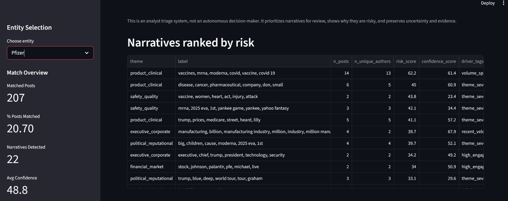
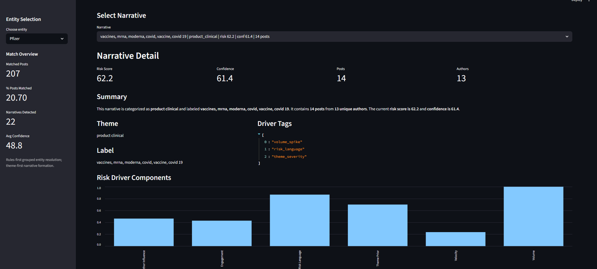

# Narrative Risk Explorer

Prototype analyst triage system for identifying and prioritizing risky online narratives around entities.

This project was developed as part of the Storyful technical assessment.

The system ingests social media posts, groups them into narratives, assigns risk scores, and surfaces evidence posts to help analysts quickly review emerging narratives.

### Core Idea

This system is designed as an analyst triage tool, not an automated decision-maker.

**Design goal**: Surface risky narratives early while maintaining analyst trust through transparency and explainability.

It:

- Detect narratives forming around entities
- Rank narratives by potential risk
- Explain why a narrative is risky
- Surface evidence posts
- Allow analysts to provide feedback

The goal is to prioritize analyst attention, not replace human judgment.

This is an analyst triage system, not an autonomous decision-maker.
It prioritizes narratives for review, shows why they are risky, and preserves uncertainty and evidence.

### System Overview

**Pipeline stages:**

Raw Posts
↓
Entity Resolution
↓
Theme Tagging
↓
Narrative Clustering
↓
Narrative Scoring
↓
Evidence Selection
↓
Analyst Interface (Streamlit)

**Architecture Overview**

The system follows a modular pipeline architecture designed to separate data preparation, narrative detection, scoring, and analyst interaction.

```
                +--------------------+
                |   Raw Social Data  |
                +--------------------+
                           |
                           v
                +--------------------+
                |  Entity Resolution |
                +--------------------+
                           |
                           v
                +--------------------+
                |    Theme Tagging   |
                +--------------------+
                           |
                           v
                +--------------------+
                | Narrative Builder  |
                |  (Clustering)      |
                +--------------------+
                           |
                           v
                +--------------------+
                |  Narrative Scoring |
                +--------------------+
                           |
                           v
                +--------------------+
                | Evidence Selection |
                +--------------------+
                           |
                           v
                +--------------------+
                | Streamlit Analyst  |
                |      Interface     |
                +--------------------+
```

The architecture separates data processing, scoring logic, and user interaction, making the system easier to maintain and extend.

### Key Design Principles

#### Rules-First Entity Resolution

Entities are grouped using deterministic rules rather than relying entirely on embeddings.

**Example aliases:**

- Pfizer
- Pfizer Inc
- pfizer

All resolve to the canonical entity Pfizer.

This approach prevents embedding-based systems from introducing false positives.

#### Theme-First Narrative Detection

Posts are first classified into high-level themes:

- product_clinical
- safety_quality
- regulatory_legal
- financial_market
- political_reputational
- executive_corporate

Clustering is then applied within themes to prevent unrelated posts from forming artificial narratives.

#### Narrative Scoring Model

Each narrative receives a composite risk score based on multiple signals.

| Signal           | Description                       |
| :--------------- | :-------------------------------- |
| Volume           | Number of posts in the narrative  |
| Velocity         | Posting speed / recency           |
| Engagement       | Likes, shares, comments, views    |
| Author Influence | Follower counts                   |
| Risk Language    | Presence of legal or safety terms |
| Theme Severity   | Prior risk weighting by theme     |

The model outputs:

- risk_score
- confidence_score
- driver_tags

These outputs help analysts understand why a narrative is ranked highly.

#### Evidence-Based Analysis

Each narrative surfaces 2–3 representative posts selected using:

- embedding similarity to narrative centroid
- engagement signals
- risk language indicators

This allows analysts to quickly evaluate the narrative without reviewing every post.

#### Analyst Feedback Loop

The interface allows analysts to provide feedback:

- Incorrect entity match
- Risk score too high / too low

Feedback is stored locally in:

`feedback/feedback.jsonl`

This feedback could later be used for:

- threshold tuning
- weak supervision
- model retraining

### Methodology

The design of this prototype emphasizes explainability and analyst usability.

Instead of relying on a single complex machine learning model, the system combines multiple interpretable components.

- **Step 1 — Entity Resolution**
  Posts are matched to entities using rule-based alias grouping.
  This ensures high precision when associating posts with companies or organizations.

- **Step 2 — Theme Tagging**
  Posts are categorized into thematic groups such as regulatory issues, financial narratives, or safety concerns.
  This step prevents clustering algorithms from mixing unrelated conversations.

- **Step 3 — Narrative Clustering**
  Within each theme, posts are grouped into narratives using text similarity and clustering.
  Each cluster represents a potential emerging narrative.

- **Step 4 — Risk Scoring**
  Each narrative receives a composite risk score using signals such as engagement, velocity, author influence, and risk language.
  This score prioritizes narratives most likely to require analyst attention.

- **Step 5 — Evidence Selection**
  Representative posts are selected for each narrative using a combination of engagement and semantic similarity.
  These posts provide analysts with immediate context.

### Streamlit Interface

The prototype interface provides several analyst tools.

#### Entity Selection

Displays:

- matched posts
- number of narratives
- average confidence

#### Narrative Triage Table

Narratives ranked by:

- risk_score
- confidence_score

#### Narrative Detail View

Displays:

- narrative summary
- risk score
- confidence score
- driver breakdown
- evidence posts

#### Feedback Capture

Allows analysts to flag:

- incorrect entity matches
- risk score calibration issues

## Interface Preview

### Narrative List



### Narrative Detail



### Repository Structure

```
storyful-riskradar
│
├─ data/                  # Raw input data
│
├─ outputs/               # Generated artifacts
│   ├─ entity_overview.csv
│   ├─ narratives.csv
│   ├─ narrative_evidence.csv
│   └─ narrative_posts.csv
│
├─ src/
│   ├─ config.py
│   ├─ data_loader.py
│   ├─ entity_resolution.py
│   ├─ theme_tagging.py
│   ├─ narrative_builder.py
│   ├─ scoring.py
│   ├─ evidence.py
│   └─ export_artifacts.py
│
├─ feedback/
│   └─ feedback.jsonl
├─ screenshots/           # Screenshots of streamlit app
│
├─ app.py                 # Streamlit analyst interface
├─ run_pipeline.py        # Pipeline entry point
├─ requirements.txt       # Python dependencies
├─ DECISIONS.md           # Tradoffs, decision and future improvements
└─ README.md
```

### Setup

#### Clone the Repository

```bash
git clone <repo-url>
cd storyful-riskradar
```

### Data Availability

The dataset used for this prototype is not included in this repository.

The assessment instructions specified that the provided data should not be uploaded to any public platform. To comply with this requirement, the raw data files have been excluded from this repository.

Reviewers should place the provided dataset files inside the data/ directory before running the pipeline.

**Note**: Reviewrs should create data/ and outputs/ folder in root before running the pipeline

### Expected directory structure:

```
data/
posts.csv
authors.csv
entities.csv
```

Once these files are copied into the data folder, the pipeline can be executed normally.

After placing the dataset files in the data/ directory, follow these steps.

#### Create a Virtual Environment

```bash
python -m venv .venv
```

Activate the environment.

**Windows**

```bash
.venv\Scripts\activate
```

**Mac / Linux**

```bash
source .venv/bin/activate
```

#### Install Dependencies

```bash
pip install -r requirements.txt
```

### Running the Pipeline

Run the narrative detection pipeline.

```bash
python run_pipeline.py
```

This generates artifacts inside the `outputs/` directory.

**Example outputs:**

- `entity_overview.csv`
- `narratives.csv`
- `narrative_evidence.csv`
- `narrative_posts.csv`

### Launching the Prototype UI

Run the Streamlit application.

```bash
streamlit run app.py
```

The interface allows analysts to:

- select entities
- review narratives
- inspect evidence posts
- provide feedback

### Limitations

This prototype intentionally prioritizes interpretability and clarity over complexity.

**Potential limitations include:**

- clustering sensitivity when datasets are small
- limited multilingual narrative support
- simple rule-based entity resolution
- limited narrative evolution tracking

### Future Improvements

**Possible extensions include:**

- HDBSCAN clustering for variable narrative density
- cosine similarity fallback for entity matching
- narrative evolution tracking across time
- cross-platform narrative linking
- feedback-driven model tuning
- automated drift detection

### Assessment Context

This prototype demonstrates:

- entity resolution
- narrative detection
- risk prioritization
- explainable scoring
- analyst workflow design

The goal is to illustrate how narrative monitoring systems can help analysts identify emerging risk narratives efficiently while maintaining transparency and human oversight.
